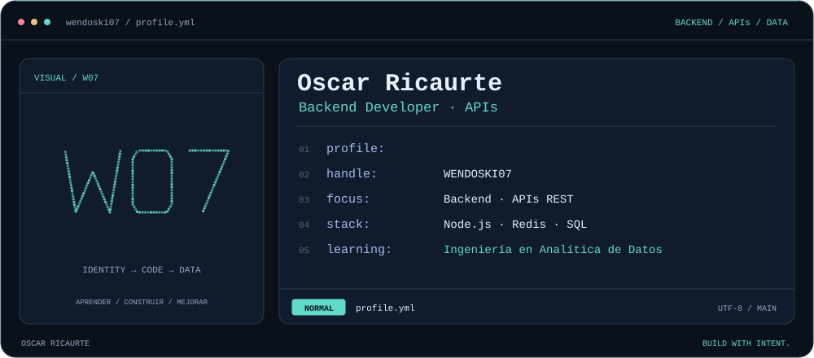
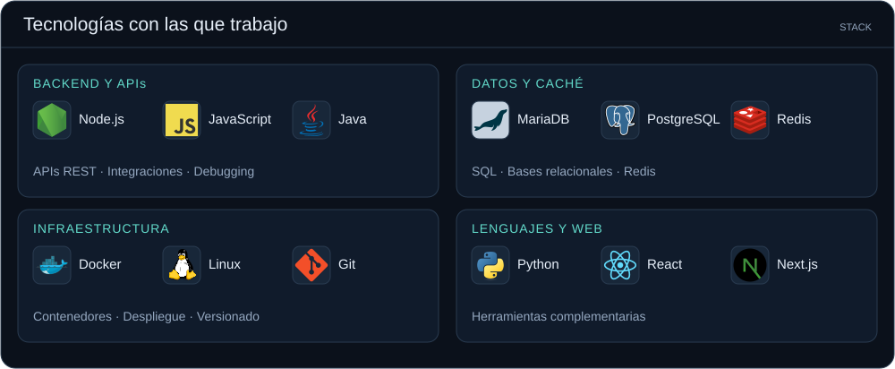
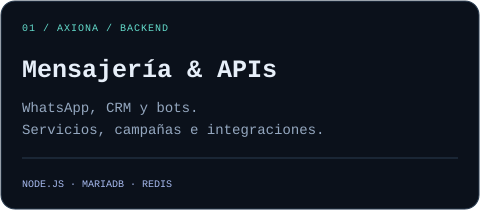
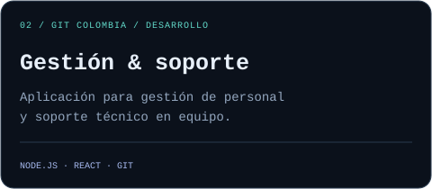

  

  <a href="#sobre-mi">Sobre mí</a> &nbsp; / &nbsp;
  <a href="#stack">Tecnologías</a> &nbsp; / &nbsp;
  <a href="#experiencia">Experiencia</a> &nbsp; / &nbsp;
  <a href="https://github.com/WENDOSKI07?tab=repositories">Repositorios</a>

## Sobre mí

Soy **Oscar Ricaurte**, desarrollador backend. Trabajo con **Node.js, APIs REST e integraciones** para aplicaciones web y plataformas de mensajería. Mi experiencia incluye bases de datos relacionales, Redis y despliegues con Docker en Linux.

Actualmente estudio **Ingeniería en Analítica de Datos** en la Universidad de Manizales. Mi interés es aplicar esa formación al desarrollo de servicios y al análisis de información.

## Tecnologías

## Experiencia

  
  

- **Axiona · Backend Developer** — Desarrollo y mantenimiento de APIs, flujos de mensajería e integraciones. Despliegue en Linux con Docker y resolución de incidencias mediante logs, bases de datos y monitoreo.
- **GIT Colombia · Desarrollo de software por proyecto** — Backend con Node.js y componentes de React para una aplicación de gestión de personal y soporte técnico, junto a un equipo de cinco personas.
- **VC Soft · Prácticas de desarrollo de software** — Revisión de pruebas de código y proyectos técnicos, y apoyo a entrevistas y evaluación de perfiles junior.

## Formación

**Ingeniería en Analítica de Datos · en curso desde 2026** 
Universidad de Manizales

**Tecnólogo en Análisis y Desarrollo de Software · 2025** 
SENA

<strong>Explorar mis repositorios públicos</strong>

Una selección de ejercicios y proyectos publicados:

- [ProyectoGit-](https://github.com/WENDOSKI07/ProyectoGit-)
- [ejemplos_php](https://github.com/WENDOSKI07/ejemplos_php)
- [Ver todos los repositorios](https://github.com/WENDOSKI07?tab=repositories)

---

  <strong>OSCAR RICAURTE</strong> 
  Backend · APIs · Datos  
  <a href="https://github.com/WENDOSKI07?tab=repositories">Explorar mi código ↗</a>

