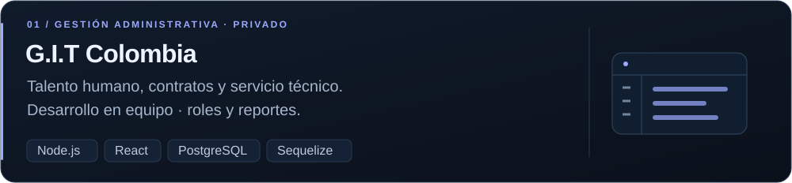
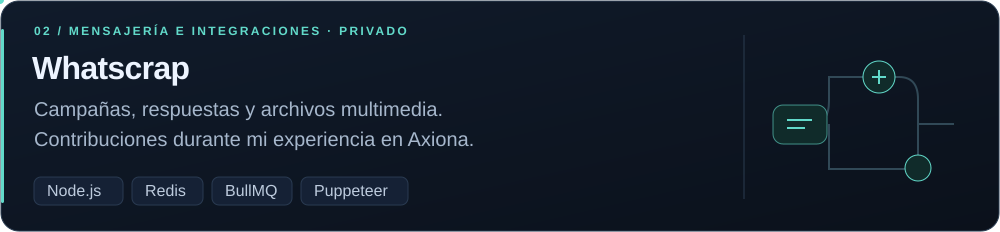
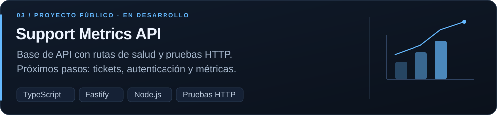
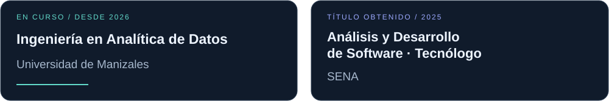

  

  <a href="#sobre-mi">Sobre mí</a> &nbsp; / &nbsp;
  <a href="#stack">Tecnologías</a> &nbsp; / &nbsp;
  <a href="#experiencia">Experiencia</a> &nbsp; / &nbsp;
  <a href="#proyectos">Proyectos</a> &nbsp; / &nbsp;
  <a href="https://github.com/WENDOSKI07?tab=repositories">Repositorios</a>

## Sobre mí

Soy **Oscar Ricaurte**, desarrollador backend. Trabajo con **Node.js, APIs REST e integraciones** para aplicaciones web y plataformas de mensajería. Mi experiencia incluye bases de datos relacionales, Redis, procesamiento de tareas en segundo plano y despliegues con Docker en Linux. También he trabajado con React en aplicaciones de gestión administrativa.

Actualmente estudio **Ingeniería en Analítica de Datos** en la Universidad de Manizales. Mi interés es aplicar esa formación al desarrollo de servicios y al análisis de información.

## Tecnologías

## Experiencia

  
  

- **Axiona · Backend Developer** — Desarrollo y mantenimiento de APIs e integraciones para mensajería con WhatsApp. Trabajo en campañas, procesamiento de respuestas y manejo de archivos multimedia con Node.js, Redis y bases de datos SQL. Despliegue en Linux con Docker y resolución de incidencias.
- **GIT Colombia · Desarrollo de software por proyecto** — Desarrollo en equipo de una aplicación para talento humano, gestión administrativa y servicio técnico. Backend con Node.js, Express, Sequelize y PostgreSQL, y componentes de interfaz con React.
- **VC Soft · Prácticas de desarrollo de software** — Revisión de pruebas de código y proyectos técnicos, y apoyo a entrevistas y evaluación de perfiles junior.

## Proyectos

  

  

  

<strong>Más sobre los proyectos y mi participación</strong>

**G.I.T Colombia:** aplicación desarrollada en equipo para talento humano, contratos, afiliaciones, clientes, servicios técnicos, visitas y costos. Incluye autenticación, roles y generación de reportes. Backend con Express y Sequelize, y frontend con React.

**Whatscrap:** mis contribuciones durante mi experiencia en Axiona incluyen mejoras en campañas, procesamiento de respuestas y manejo de imágenes y audio. Utiliza Express, Redis, BullMQ, Puppeteer y SQL.

**Support Metrics API:** proyecto personal de aprendizaje y portafolio. Actualmente tiene un servidor básico con rutas de salud e información y pruebas HTTP; la gestión de tickets, autenticación y métricas sigue pendiente.

Los dos proyectos de experiencia profesional se mantienen privados. Sus tarjetas presentan el trabajo realizado sin publicar su código.

## Formación

  

<strong>Explorar mis repositorios públicos</strong>

Una selección de proyectos y ejercicios disponibles para consultar:

- [Support Metrics API](https://github.com/WENDOSKI07/support-metrics-api) — API de aprendizaje con TypeScript y Fastify.
- [ProyectoGit-](https://github.com/WENDOSKI07/ProyectoGit-) — Prototipo inicial de GIT Colombia en HTML y CSS.
- [ejemplos_php](https://github.com/WENDOSKI07/ejemplos_php) — Ejercicios de PHP.
- [Ver todos los repositorios](https://github.com/WENDOSKI07?tab=repositories)

---

  <strong>OSCAR RICAURTE</strong> 
  Backend · APIs · Datos  
  <a href="https://github.com/WENDOSKI07?tab=repositories">Explorar mi código ↗</a>

